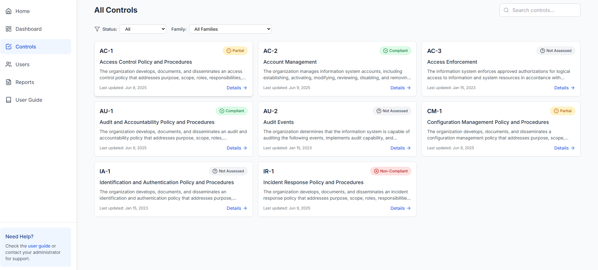
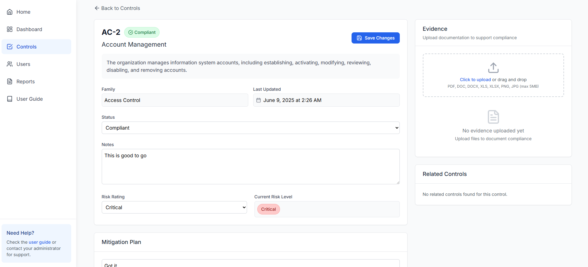
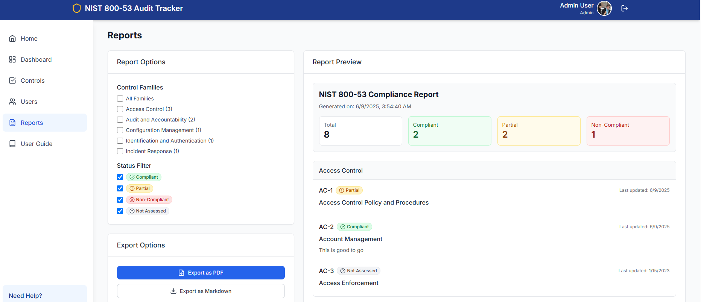

# NIST 800-53 Audit Tracker

A comprehensive web application for tracking and documenting compliance with NIST 800-53 security controls. This application helps organizations manage their security compliance efforts, upload evidence, and generate detailed reports.

## 📊 Risk Assessment Dashboard

<div align="center">
  
  
  
  
  
</div>

## 🚀 Features

- **Control Management**: Track and assess all NIST 800-53 security controls
- **Evidence Upload**: Attach documentation and evidence to support compliance
- **Risk Assessment**: Assign risk ratings and create mitigation plans
- **Role-Based Access**: Three-tier permission system (Admin, Contributor, Viewer)
- **Dashboard Analytics**: Visual overview of compliance status and metrics
- **Report Generation**: Export comprehensive reports in PDF and Markdown formats
- **User Management**: Admin tools for managing user accounts and permissions
- **Responsive Design**: Works seamlessly on desktop and mobile devices

## 🛠️ Technology Stack

- **Frontend**: React 18 with TypeScript
- **Styling**: Tailwind CSS
- **Icons**: Lucide React
- **Build Tool**: Vite
- **PDF Generation**: jsPDF
- **Routing**: React Router DOM
- **State Management**: React Context API

## 📋 Prerequisites

- Node.js (version 16 or higher)
- npm or yarn package manager

## 🚀 Getting Started

### Installation

1. Clone the repository:
```bash
git clone https://github.com/yourusername/nist-800-53-audit-tracker.git
cd nist-800-53-audit-tracker
```

2. Install dependencies:
```bash
npm install
```

3. Start the development server:
```bash
npm run dev
```

4. Open your browser and navigate to `http://localhost:5173`

### Demo Accounts

The application includes three demo accounts for testing different permission levels:

- **Admin**: `admin@example.com` (Full access to all features)
- **Contributor**: `contributor@example.com` (Can update controls and manage evidence)
- **Viewer**: `viewer@example.com` (Read-only access)

*Note: Any password will work for demo accounts*

## 📖 User Guide

A comprehensive user guide is available within the application at `/guide` or by clicking the "User Guide" link in the sidebar. The guide covers:

- Getting started and navigation
- Dashboard overview
- Managing controls and assessments
- Evidence management
- Report generation
- User management (Admin only)
- User roles and permissions
- Frequently asked questions

## 🏗️ Project Structure

```
src/
├── components/          # Reusable UI components
│   ├── common/         # Generic components (Button, Card, etc.)
│   ├── controls/       # Control-specific components
│   └── layout/         # Layout components (Header, Sidebar, etc.)
├── context/            # React Context providers
├── data/               # Static data and mock data
├── pages/              # Page components
├── services/           # External service integrations
├── types/              # TypeScript type definitions
└── main.tsx           # Application entry point
```

## 🎨 Design System

The application uses a comprehensive design system with:

- **Color Palette**: Primary, secondary, accent, success, warning, and error colors
- **Typography**: Inter font family with consistent sizing
- **Spacing**: 8px grid system
- **Components**: Consistent button styles, form elements, and cards
- **Animations**: Smooth transitions and micro-interactions

## 🔐 Security Features

- Role-based access control (RBAC)
- Secure file upload handling
- Input validation and sanitization
- Protected routes based on user permissions

## 📊 Compliance Features

- **Control Families**: Organized by NIST 800-53 control families
- **Status Tracking**: Compliant, Partial, Non-Compliant, Not Assessed
- **Risk Ratings**: Low, Medium, High, Critical
- **Evidence Management**: File upload and organization
- **Audit Trail**: Track changes and updates
- **Reporting**: Comprehensive compliance reports

## 🚀 Deployment

### Build for Production

```bash
npm run build
```

The built files will be in the `dist` directory, ready for deployment to any static hosting service.

### Deployment Options

- **Netlify**: Drag and drop the `dist` folder
- **Vercel**: Connect your GitHub repository
- **GitHub Pages**: Use GitHub Actions for automated deployment
- **AWS S3**: Upload the `dist` folder to an S3 bucket

## 🤝 Contributing

1. Fork the repository
2. Create a feature branch (`git checkout -b feature/amazing-feature`)
3. Commit your changes (`git commit -m 'Add some amazing feature'`)
4. Push to the branch (`git push origin feature/amazing-feature`)
5. Open a Pull Request

## 📝 License

This project is licensed under the MIT License - see the [LICENSE](LICENSE) file for details.

## 🙏 Acknowledgments

- [NIST](https://www.nist.gov/) for the 800-53 security controls framework
- [React](https://reactjs.org/) for the excellent frontend framework
- [Tailwind CSS](https://tailwindcss.com/) for the utility-first CSS framework
- [Lucide](https://lucide.dev/) for the beautiful icons

## 📞 Support

For questions or support, please:

1. Check the [User Guide](src/pages/UserGuidePage.tsx) within the application
2. Review the [FAQ section](#faq) in the user guide
3. Open an issue on GitHub
4. Contact the development team

## 🔮 Future Enhancements

- Integration with external compliance management systems
- Advanced analytics and reporting
- Automated control assessment workflows
- API for third-party integrations
- Multi-tenant support
- Advanced search and filtering capabilities

---

**Built with ❤️ for cybersecurity professionals and compliance teams**